## 前言
近日，我来到上海华东师范大学滴水湖软件学院ROS暑校，参加了宇树科技的课程，并了解了一些ROS的相关知识与应用，接下来这篇blog会带领你从安装WSL到在仿真器Gazebo上运行 unitree_guide 来快速入门 unitree_guide 工程。

# 0.安装WSL

## 0.1什么是WSL
>WSL（Windows Subsystem for Linux）是微软为 Windows 10 和 Windows 11 用户提供的一种兼容层，允许在 Windows 操作系统上原生运行 Linux 二进制可执行文件。WSL 使得开发人员能够在 Windows 环境中使用 Linux 工具和应用程序，而无需安装虚拟机或双重启动。

WSL 的主要特点:

>原生 Linux 环境：WSL 提供了一个接近原生的 Linux 环境，用户可以直接在 Windows 上运行 Linux 命令行工具和应用程序。

>多种 Linux 发行版支持：用户可以从 Microsoft Store 安装多种 Linux 发行版，如 Ubuntu、Debian、Kali Linux、Fedora 等。

>文件系统访问：WSL 允许用户访问 Windows 文件系统和 Linux 文件系统之间的文件。你可以通过路径访问 Windows 文件（如 /mnt/c/ 访问 C 盘）和 Linux 文件。

>命令行工具：用户可以使用 Linux 的命令行工具（如 bash、grep、sed、awk 等）来进行开发和管理任务。

>集成开发环境：WSL 可以与 Visual Studio Code 等开发工具集成，使开发人员能够在熟悉的环境中使用 Linux 工具。


## 0.2 怎么安装WSL
### 方法一
1.在开始菜单中搜索Windows功能，出现以下界面，勾选红色方框的内容后点击确定。

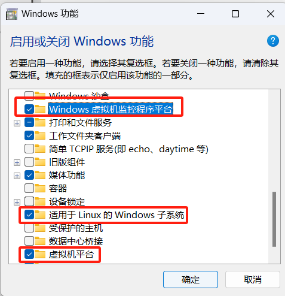

2.在微软商店中搜索你需要的Linux发行版并下载，这里我选择ubuntu20.04LTS。

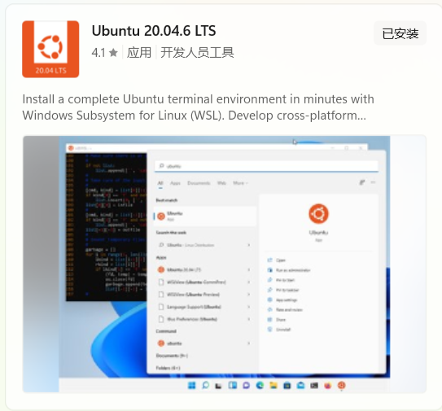

3.下载完成后你就可以在终端中找到该发行版啦。

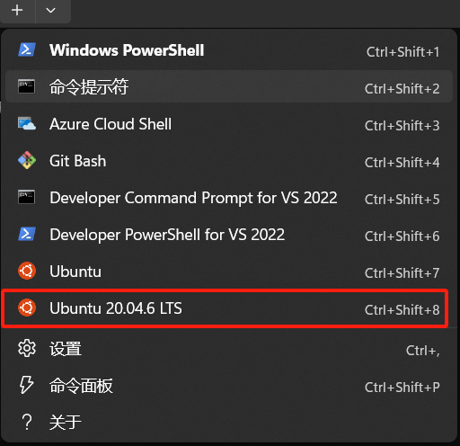

### 方法二
1.打开PowerShell，以管理员身份运行。
输入命令：`wsl --install`。

2.重启后以管理员模式运行PowerShell，输入
```
wsl --update
wsl --set-default-version 2
wsl --shutdown
wsl --install -d Ubuntu-20.04
```
---------------------一条美丽的分割线--------------------------------

 安装完WSL后，再次打开PowerShell，输入命令行`wsl -l -v`，如果显示了发行版名称、运行状态和WSL版本，就说明安装成功了。

 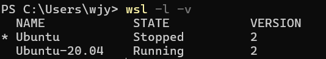

（为什么我有两个Ubuntu？这个说来话长，其实就是小孩子不懂事乱装的。现在嘛，第二个20.04装ROS1 noetic，第一个22.04装ROS2 humble刚好）

# 1.安装ROS
>ROS（Robot Operating System）是一个开源的机器人软件平台，提供了一系列工具、库和约定，旨在帮助开发者创建机器人应用。尽管名字中有“操作系统”，但 ROS 实际上是一个框架，运行在不同的操作系统上（如 Linux、Windows 和 macOS），并且通常在 Ubuntu 上使用最为广泛。

## 1.1在什么平台上安装什么版本的ROS
我们以Ubuntu 20.04LTS为例，安装**ROS1 noetic**版本。
想必聪明的你一定在想，为什么安装ROS1而不是ROS2？
答：目前，ROS2生态系统仍在发展中，虽说越来越多的新项目和库开始使用ROS2，但ROS1相较拥有更成熟的生态系统和大量的现有软件包。并且，宇树的这套代码是基于ROS1开发的，所以我们选择安装ROS1 noetic。

## 1.2 怎么安装
很简单，点击[鱼香ROS官网](https://fishros.com/)，找到**一键安装：**

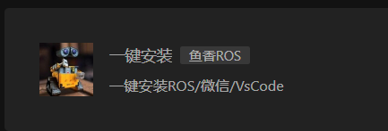

按照指示一路选择下去即可（记得选择ROS1 noetic版本！）

安装完后在wsl上输入命令行`rosversion -d`，如果返回noetic则说明安装成功！

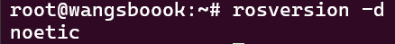

# 2.安装Gazebo

如果是虚拟机或者双系统，安装完ROS之后就可以直接安装Gazebo等仿真软件了，但咱不一样，我们用的是WSL子系统，WSL是不自带图形用户界面的，因此即使你安装了Gazebo，你也无法显示Gazebo的图形界面。看到这是不是人傻了，不过没关系，咱们配置一下X服务器就可以了。（不过WSL在性能上不如原生Linux，尤其是在处理图形密集型应用时，可能会遇到延迟或性能瓶颈（这一点我深有感触（已老实。）））

## 2.0 安装X服务器

### 2.0.1 什么是X服务器

>X 服务器是一个用于图形用户界面（GUI）显示的系统，它是 X Window System（通常称为 X11 或 X）的核心组件。X Window System 是一个用于在类 Unix 操作系统（如 Linux 和 BSD）上提供图形用户界面的协议和系统。

### 2.0.2 怎么安装X服务器

1.打开WSL,更新软件包列表：

`sudo apt update`

2.安装**X11服务器**：

`sudo apt install xorg`

3.安装**X11窗口管理器**，例如xfce4：

`sudo apt install xfce4`

4.安装x11-apps来获取**X11应用程序**：

`sudo apt install x11-apps`

**5.配置DISPLAY环境变量**：（因为配错了环境变量硬控我好久 ！！）

>在 WSL 2 中，Linux 子系统的 IP 地址与 Windows 主机的 IP 地址不同。
连接 X 服务器时，您应该使用主机IP localhost 或 127.0.0.1 来设置 DISPLAY 环境变量，而不是 WSL 2 的 IP 地址。

在WSL中输入`export DISPLAY=localhost:0`,将DISPLAY环境变量设为Windows主机的IP地址。

然后输入`echo $DISPLAY`检测一下，如果返回

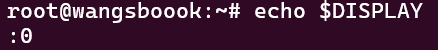

则说明配置成功。

6.启动X11服务。

可以运行一下`xeyes`,如果出现下面这个窗口，说明X服务器安装成功了。


7.如果想要Linux图形化用户界面，还需要安装[VcXsrv](https://sourceforge.net/projects/vcxsrv/)。

按照[这位博主](http://t.csdnimg.cn/qj8np)的教程，可以在Windows终端中输入`ipconfig`来查找WSL本地IP，然后出现了两个WSL的IP：

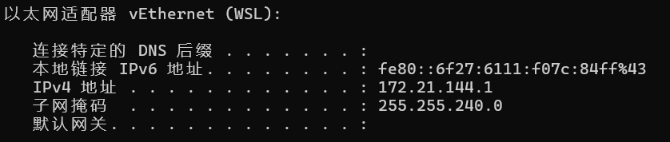和

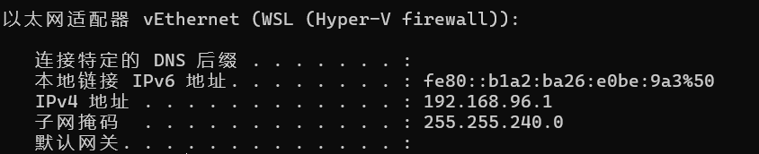

博主写的是配置为第二个（hyper-v）的ipv4地址，而我昨天弄成了第一个，导致可以看到图形用户界面，但是死活打不开gazebo；而我今天把环境变量**直接改成主机的IP**（localhost，墙裂推荐，不需要查IP，而且非常好记），可以在gazebo上跑工程了，但是又看不到LinuxGUI了（玄学，有没有大佬懂的求解答！）

我之前也查过vEthernet (WSL)和vEthernet (WSL (Hyper-V firewall))的区别：

>1. vEthernet (WSL)
功能：这是 WSL 2 使用的主要虚拟网络适配器。
它允许 WSL 2 实例（Linux 发行版）与 Windows 主机之间进行网络通信。
用途：通过这个适配器，WSL 2 可以访问互联网和本地网络资源。WSL 2 会通过这个适配器获取 IP 地址，并与主机系统共享网络连接。
IP 地址：WSL 2 实例通常通过 DHCP 从这个适配器获取动态 IP 地址。
>2. vEthernet (WSL (Hyper-V firewall))
功能：这个适配器与 Hyper-V 防火墙相关，主要用于管理 WSL 2 实例的网络流量。
用途：它用于提供额外的网络安全层，可能涉及到防火墙规则和网络流量的管理。这个适配器主要是为了确保 WSL 2 实例的网络通信不会受到不必要的干扰，并确保安全性。
IP 地址：这个适配器通常不会直接用于 WSL 2 实例的网络连接，而是作为网络流量管理的一部分。

看了这个之后我更加觉得应该是第一个啊，与主机系统共享网络连接，第二个又是流量又是防火墙的，和主机啊图形界面啊有什么关系（难道说是那个博主写错了？不管了，反正写主机地址准没错）

咳咳，感觉跑偏了！！其实单纯想要运行gazebo，不要那GUI（指VcXsrv）也行，把X服务器配置好就行。然后我们赶紧来讲怎么安装gazebo吧

## 2.1 真正安装Gazebo

1.添加 Gazebo 仓库：
```
sudo sh -c 'echo "deb http://packages.osrfoundation.org/gazebo/ubuntu-stable $(lsb_release -cs) main" > /etc/apt/sources.list.d/gazebo-stable.list'

wget http://packages.osrfoundation.org/gazebo.key -O - | sudo apt-key add -
```
2.更新包索引并安装 Gazebo：

```
sudo apt-get update
sudo apt-get install gazebo11
```

3.启动 Gazebo：

安装完成后，可以通过命令行输入`gazebo`启动 Gazebo。

# 3.在Gazebo上跑宇树的工程

指路[宇树官方文档](https://support.unitree.com/home/zh/Algorithm_Practice/quickstart)，自行探索（写累了）。其实就是到GitHub下几个包，可以远程clone，也可以下载zip文件然后scp然后unzip。

在catkin_ws工作空间`catkin_make`一下，没有报错就编译成功了（报错了就补几个包，反正我是这样的）。

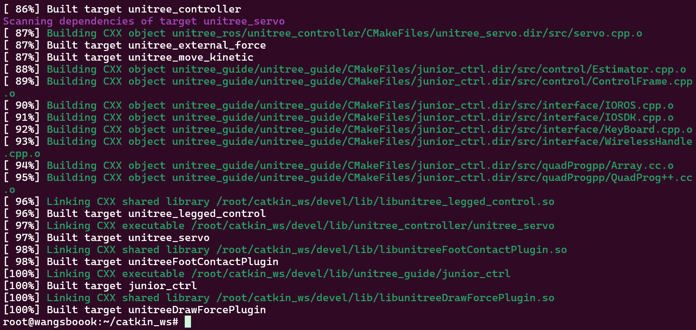

输入到`roslaunch unitree_guide gazeboSim.launch`这行的时候注意一下，如果是用scp复制的文件夹，文件夹名字后面都会带个-main，这时候直接输`roslaunch unitree_guide gazeboSim.launch`会报没有这个文件夹的错，把`roslaunch unitree_guide gazeboSim.launch`改成`roslaunch unitree_guide_main gazeboSim.launch`好像也不行，我就直接把带-main的重命名去掉了。

跑起来之后就是宇树狗趴在地上

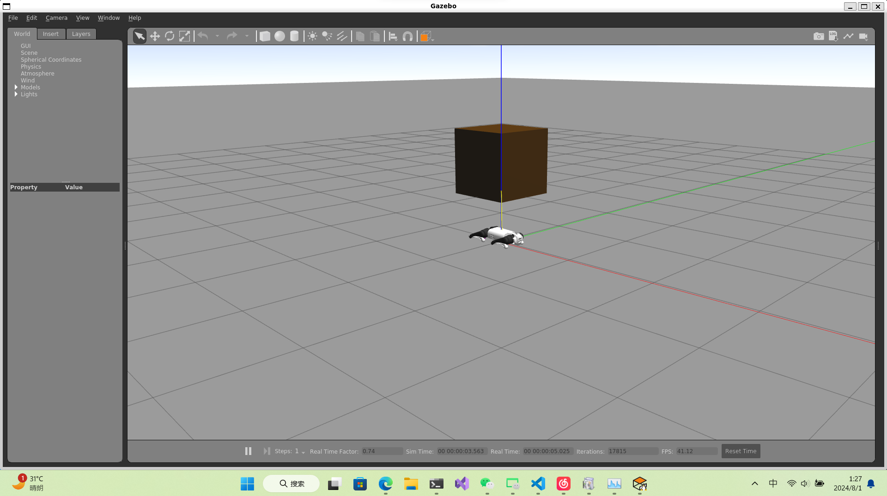

然后我的电脑也开始烧起来了（害怕）

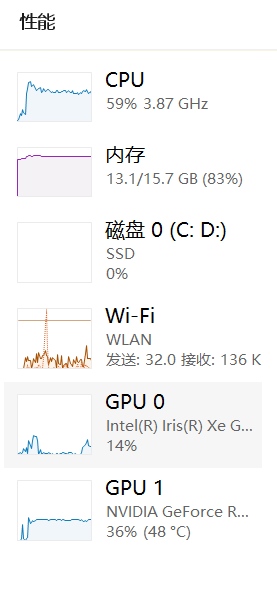

然后在同个工作空间再开一个终端，用来控制宇树狗运动

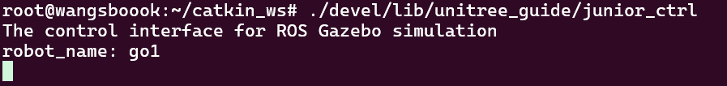

别人虚拟机上跑的：
<video controls src="ab07cf00e3161a8796ee35936e73d11b.mp4" title="Title"></video>

我录的WSL上跑的：
<video controls src="d3b2ae2756c2b33ce7d56ecd22763f8e.mp4" title="Title"></video>
（我只能说卧龙凤雏，WSL至少还能调GPU，结果也跑成ppt了，真的难绷，这下老实了）

双系统跑的：
<video controls src="784f87c4b98c6adbb0a213d8dd32231d_raw.mp4" title="Title"></video>

（当然也有可能是人家的显卡比较牛逼）（改天我也用双系统试试，反正相同硬件双系统跑仿真表现肯定比子系统好）

# 4.结语
就是这样，感觉写着写着变成非常不靠谱的唠嗑。以上纯基于个人经验与感受，对于底层原理并没有很透彻的理解。求指点。求溺爱。

2024/7/31
